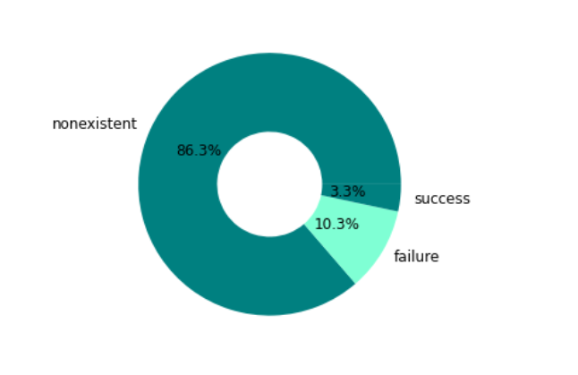
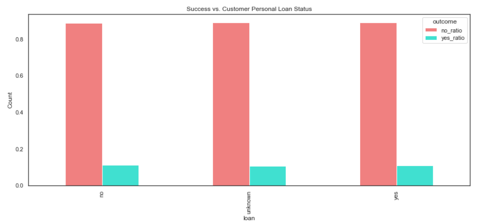

# Bank_Marketing_Term_Deposits

## Project Overview

We have a marketing campaign dataset from a Portuguese bank offering clients to open term deposits. It is a telemarketing campaign that directly contacts the clients and persuade them to agree to opening term deposits. We will be creating a classification algorithm and also suggest them the insights we derive from this dataset and also help them to narrow down their leads into marketing funnel for a more successful campaign.

## Problem Statement

There has been a revenue decline for the Portuguese bank and they would like to know what actions to take. After investigation, we found out that the root cause is that their clients are not depositing as frequently as before. Knowing that term deposits allow banks to hold onto a deposit for a specific amount of time, so banks can invest in higher gain financial products to make a profit. In addition, banks also hold better chance to persuade term deposit clients into buying other products such as funds or insurance to further increase their revenues. As a result, the Portuguese bank would like to identify existing clients that have higher chance to subscribe for a term deposit and focus marketing effort on such clients.

## Dataset

- Available on [Kaggle](https://www.kaggle.com/datasets/henriqueyamahata/bank-marketing)

## Tools Used
- Python (Pandas, Numpy, Matplotlib, Seaborn, Scikit-Learn)
- Jupyter Notebook

## About the Data

 The dataset contains 41,188 rows and 21 columns. The features are as follows :
 
 #### Bank Client Data
 
 1. Age : Age of the lead (numeric)
 2. Job : type of job (Categorical)
 3. Marital : Marital status (Categorical)
 4. Education : Educational Qualification of the lead (Categorical)
 5. Default: Does the lead has any default(unpaid)credit (Categorical)
 6. Housing: Does the lead has any housing loan? (Categorical)
 7. loan: Does the lead has any personal loan? (Categorical)
 8. Contact: Contact communication type (Categorical)
 9. Month: last contact month of year (Categorical
 10. day_of_week: last contact day of the week (categorical)
 11. duration: last contact duration, in seconds (numeric)
 12. campaign: number of contacts performed during this campaign and for this client (numeric)
 13. pdays: number of days that passed by after the client was last contacted from a previous campaign(numeric; 999 means client was not previously contacted))
 14. previous: number of contacts performed before this campaign and for this client (numeric)
 15. poutcome: outcome of the previous marketing campaign (categorical)
 16. emp.var.rate: employment variation rate - quarterly indicator (numeric)
 17. cons.price.idx: consumer price index - monthly indicator (numeric)
 18. cons.conf.idx: consumer confidence index - monthly indicator (numeric)
 19. euribor3m: euribor 3 month rate - daily indicator (numeric)
 20. nr.employed: number of employees - quarterly indicator (numeric)
 21. y - has the client subscribed a term deposit? (binary: 'yes','no') **Target Feature**

## Data Exploration and Visualization

#### Campaign Outcome

We can clearly see the problem here. Out of all the customers that were contacted for this campaign, only 11.3% agreed to open term deposits, while the vast majority of 88.7% declined the offer. A lot of effort was wasted on customers who do not fit in the potential buyer category. This problem requires solution so that company can target only the potential customers which have higher probability to buy that product instead of wasting efforts on the customers which have lower probability of buying that product.

### Who were the target customers for the campaign?

Let us first dive into the details of the customers that were contacted for this campaign.

####  Target Customer Job Profile

- Majority of the customers targeted have Admin, Blue-Collar or technician type jobs.

#### Target Customer Marital Status

- Majority of the targeted customers are married individuals.

#### Target Customer Education Level

- Majority of the targeted customers have university degrees or are high school graduates.

#### Target Customer Default History

- Majority of the targeted customers have no default history.

#### Target Customer Personal Loan Status

- Majority of the targeted customers have no personal loans.

#### Target Customer Housing Loan Status

- Majority of the targeted customers do have housing loans.

#### Target Customer Communication Method

- Majority of the targeted customers were contacted on their cellular devices.

#### Target Customer Contact Month

- The targeted customers were mostly contacted in the month of May.

#### Target Customer Contact Weekday

- The targeted customers were mostly contacted on Mondays and Thursdays

#### Outcome of the previous campaign

- 3.3 % of the previous campaign was successful.

#### Target Customer Age Group

- Mostly young customers within the age range of 31- 50 years were targeted for the campaign.

### Contact History

#### Call Duration

- The campaign call durations were between 50 and 800 seconds.

#### No. of times contacted during campaign

- Many customers were contacted multiple times.

#### No. of days passed since last contact

- Majority of the customers were contacted for the first time.

#### EVR (Employment Variation Rate)

- Majority of the calls were made when the EVR was more than -0.2.

#### Euribor (3 month rate)

## Correlation between EVR, Euribor and Number of Employees

- There is a strong positive correlation between EVR, Euribor and Number of Employees. Particularly, EVR is always negative when Euribor is less than 3.

## Summary of Target Customers

- 98% of the targeted customers fall between an age range of 20 and 65. Customers between age range of 31-50 years were most heavily targeted for the campaign.
- Majority of the targeted customers have admin, blue-collar or technician type jobs.
- Majority of the targeted customers are married.
- Majority of the targeted customers have University degrees.
- Majority of the targeted customers have no default history.
- Majority of the targeted customers do have current housing loans.
- Majority of the targeted customers do not have any personal loans.
- Majority of the targeted customers were targeted on cellular phones.
- Majority of the targeted customers were contacted in the month of May.
- The customers were mainly contacted on Mondays and Thursdays.
- The campaign call durations were between 50 and 800 seconds.
- Majority of the customers were contacted for the first time for the current campaign.
- Some customers were called multiple times during this campaign.
- For the previous campaign, only 3.3% were successful, 10.3% failed and the rest was non-existent.
- Majority of the calls were made when the EVR was more than -0.2.
-  Majority of the calls were made when Euribor is greater than 3.5

## Successful Campaign

Now, let us look at the features of the customers that actually agreed to open the term deposits.

#### Successful Customer Job

- Majority of the customers who agreed to open term deposits are students or retired individuals.

#### Successful Customer Marital Status

- Majority of the successful customers are single.

#### Successful Customer Age Bracket

- Customers who agreed to open term deposits are either less than 20 years old or more than 70 years old.

#### Successful Customer Education

- Majority of the successful customers are actually illeterate.

#### Successful Customer Default Status

- The successful customers have either no default history or an unknown default status.

#### Successful Customer Housing Loan

- The successful customers' housing loan status does not seem to have much impact on their decision.

#### Successful Customer Personal Loan

- The successful customers' personal loan status does not seem to have much impact on their decision.

#### Successful Customer Contact Month

- Majoriy of the successful customers were contacted in March, September, October and December.

#### Successful Customer Contact Weekday

- Majority of the successful customers were contacted on Tuesdays and Thursdays.

#### Successful Customer Campaign Bracket

- Majority of the successful customers were contacted only once for the campaign or less than 5 times. As the number of contacts increase, the probability of saying yes to the campaign decreases.

#### Previous Campaign Outcome

- Customers who said yes to previous campaigns have significantly higher chances of saying yes to this campaign.

#### EVR 

- Chances of success are higher when EVR is negative.

#### Euribor

- Chances of success are higher when euribor is less than 2.

 
